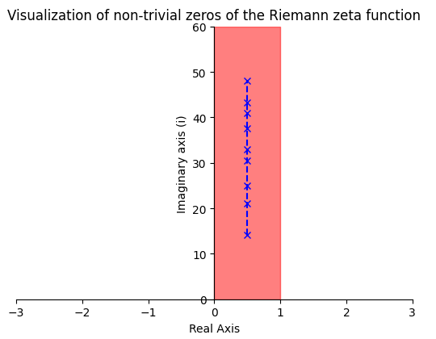

This project is all about the [Riemann Hypothesis](https://en.wikipedia.org/wiki/Riemann_hypothesis)

It generates and visualizers some of the zeros of the Riemann zeta function as seen below:

#### How to run:
1. `pip install mpmath`

2. `pip install matplotlib`

3. `pip install numpy`

4. `python riemann.py`

